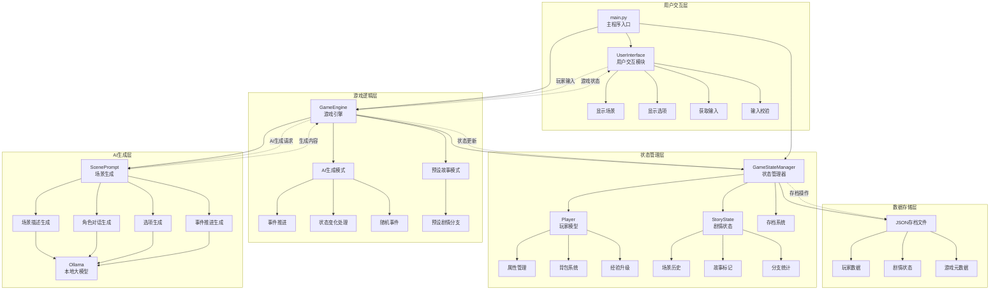
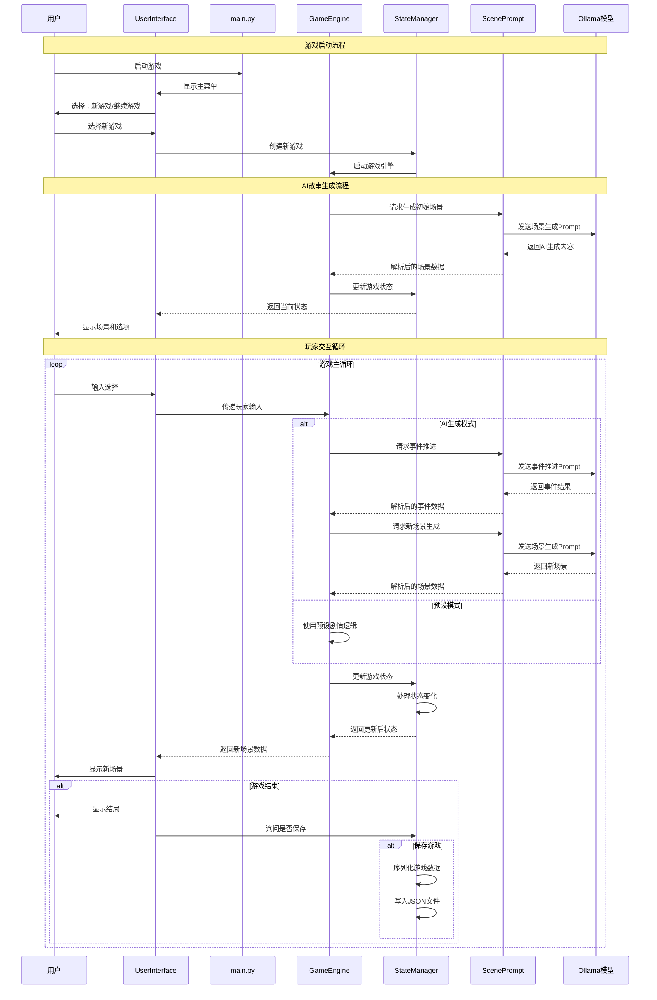
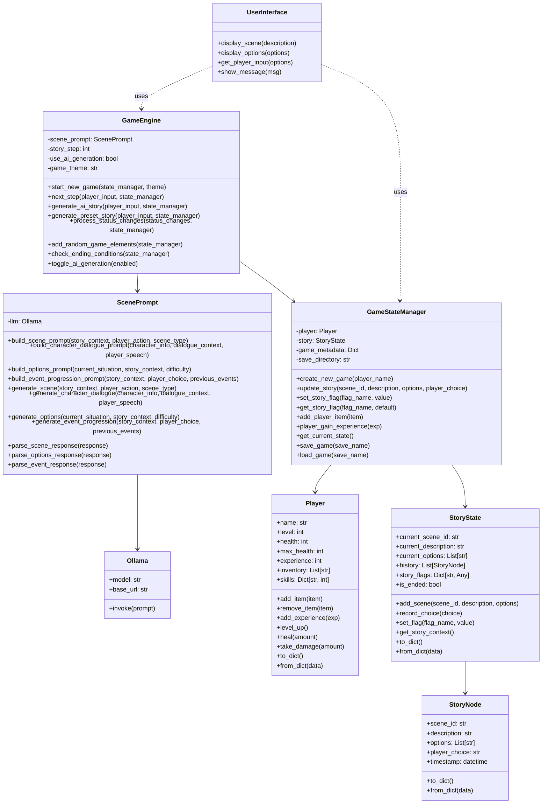

基于当前项目的代码结构和实现，我为你总结了文字冒险游戏的业务流程和架构。以下是详细分析：

## 🏗️ 系统架构总览

**第一个图**展示了系统的**分层架构**，包含5个核心层次：

### 1. 用户交互层
- **UserInterface**: 负责命令行界面的输入输出
- **main.py**: 程序入口，控制主菜单和游戏循环

### 2. 游戏逻辑层  
- **GameEngine**: 核心游戏引擎，支持AI生成和预设两种模式
- 处理玩家输入，生成故事内容，管理游戏流程

### 3. 状态管理层
- **GameStateManager**: 统一管理游戏状态
- **Player**: 玩家属性、背包、经验系统
- **StoryState**: 剧情状态、历史记录、故事标记

### 4. AI生成层
- **ScenePrompt**: 四种专业提示词模板
- **Ollama**: 本地大语言模型服务

### 5. 数据存储层
- JSON格式的存档文件系统

## 🔄 业务流程时序

**第二个图**展示了完整的**游戏运行时序**：

1. **启动阶段**: 用户选择新游戏或继续游戏
2. **初始化阶段**: AI生成初始场景或加载存档
3. **主循环阶段**: 玩家输入 → AI生成 → 状态更新 → 显示结果
4. **结束阶段**: 保存游戏或退出

## 📊 类关系结构

**第三个图**展示了**详细的类设计**：

### 核心特点：
- **松耦合设计**: 各模块职责清晰，便于扩展
- **双模式支持**: AI生成 + 预设故事的混合模式
- **完整状态管理**: 玩家属性、剧情状态、存档系统
- **AI集成**: 四种提示词类型，支持复杂故事生成

### 数据流向：
```
用户输入 → GameEngine → ScenePrompt → Ollama → 解析响应 → 更新状态 → 显示结果
```

## 🎯 技术亮点

1. **AI驱动的故事生成**: 每次游玩都有不同体验
2. **容错机制**: AI失败时自动回退到预设剧情  
3. **模块化设计**: 易于扩展新功能和游戏主题
4. **完整的RPG要素**: 经验、升级、物品、随机事件
5. **灵活的存档系统**: 支持多存档管理

这个架构设计既保证了游戏的稳定性，又充分利用了AI的创造性，为玩家提供了丰富多变的游戏体验。